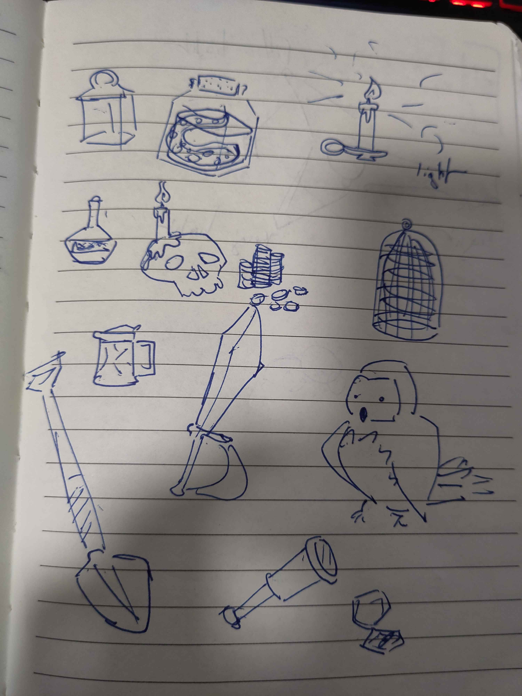
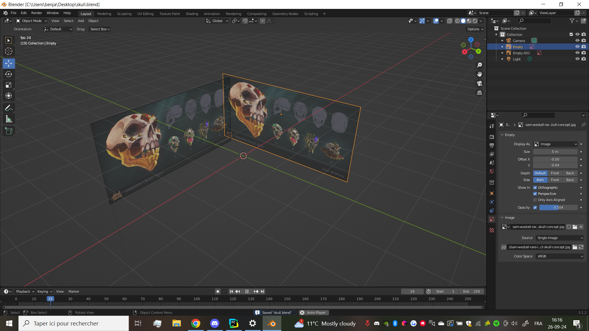
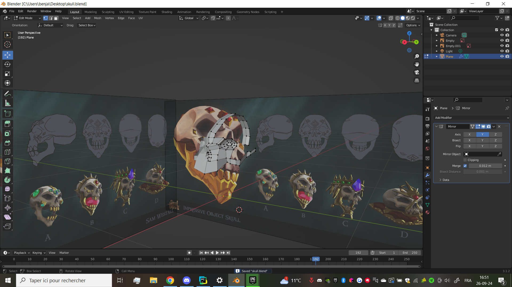
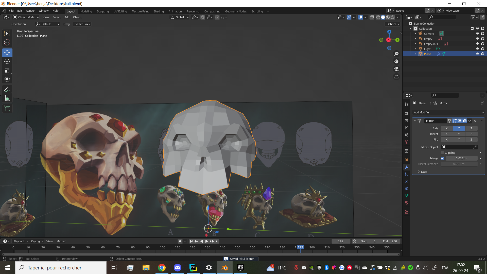
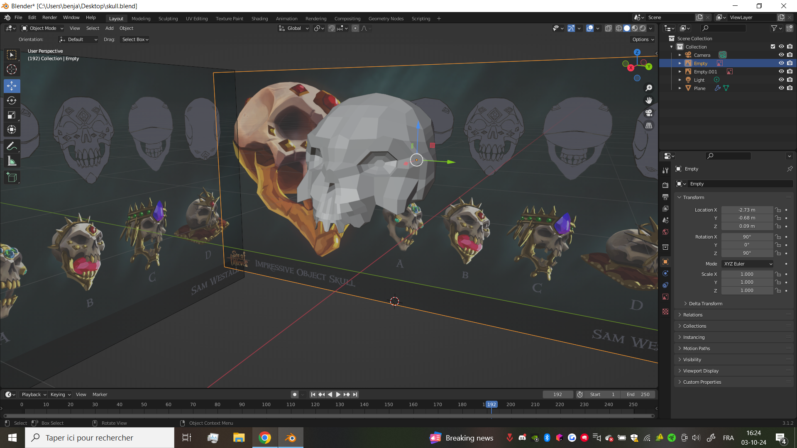
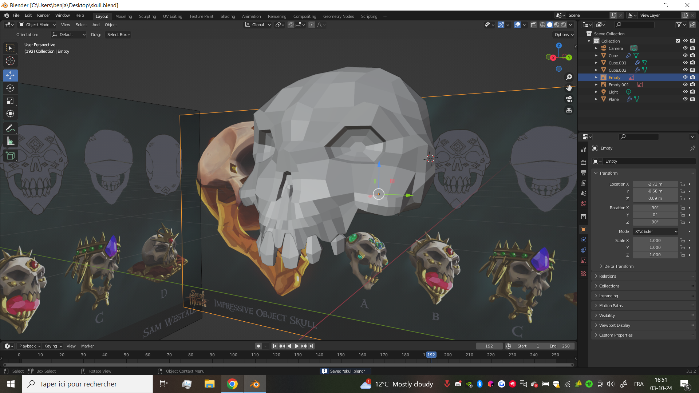
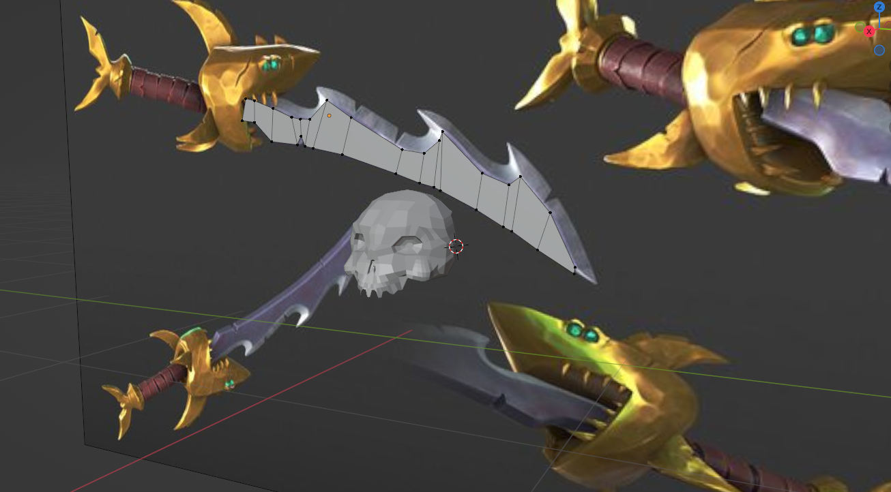
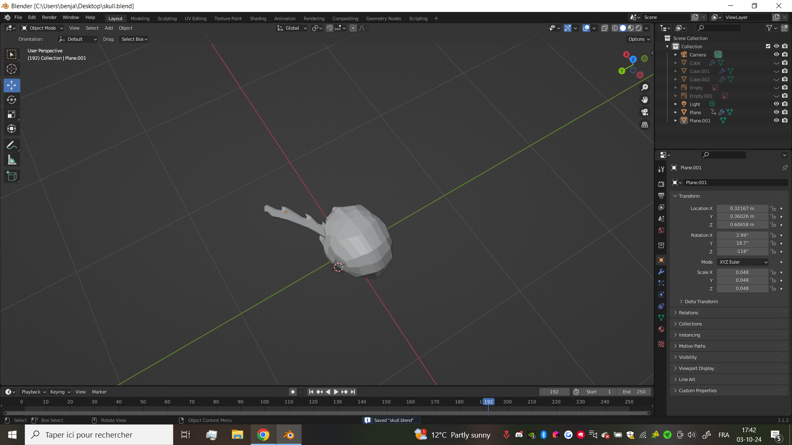
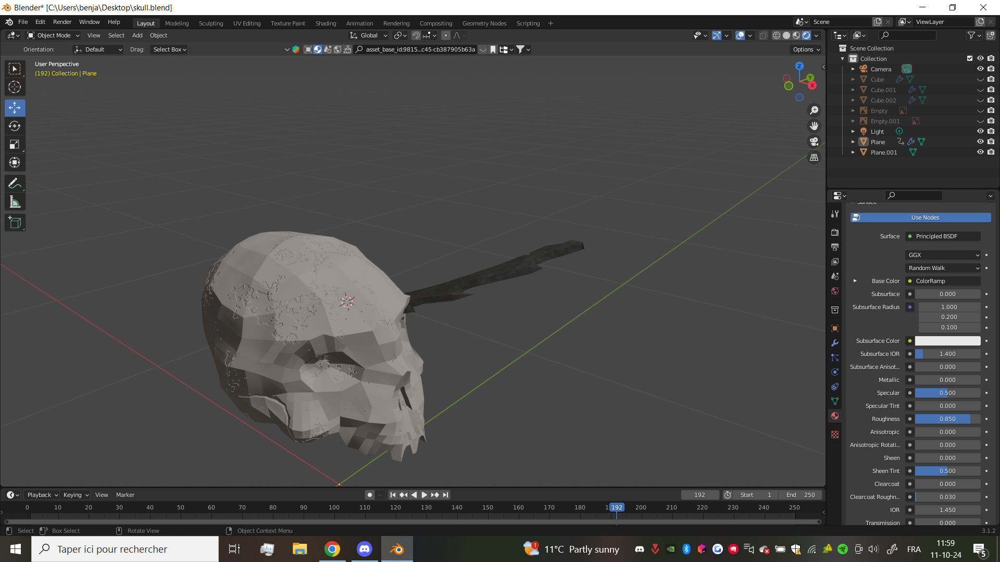

# Render

## Benjamin Bourge

## Chest

### External Resources

- background image:
    - <https://johanlagesson.artstation.com/projects/6DEE5> [background image](Blender/johan-lagesson-16.jpg)

- reference image:
    - <https://www.artstation.com/artwork/4bPm5n> [reference image](Reference/reference.jpg)

### Explanation / Thinking

#### Reference
The skull was created by Benjamin Bourge using Blender.

at first, I drew some known items in the pirate world, and chose one of these, the skull.

The first step was to use a reference sheet, so I chose one from the concept art of Sea of Thieves, going with the pirate theme we selected.

Once the reference was found, I positioned the image in Blender to use the Axis-View,
allowing me to quickly get a 3D view of my object.

#### The Shape

First, I created a plane, and started creating the vertices. To do this, I used extrude (E) and fill (F) to form multiple faces on the skull. Beginning from the front, I modeled the
nose and eyes, then started drafting the main shape of the skull with a line going around it. I applied the 'Mirror' modifier so I only needed to sculpt half of the skull.

After finishing it, I focused on the front, but didn’t add too much detail, as seen in the mouth, which lacks precision. The main goal was to draft the shape, so I could spend
time later on improvements.

#### The Details

I then started improving the mouth by removing it first, and adding more vertices, edges, and faces to achieve better definition. The teeth are still missing for now, but they will be
separates objects.

Each tooth was created from a cube, subdivided to slightly modify its shape. The teeth are mirrored, so technically, there are only three unique teeth.

#### The Blade

I didn’t want to do just a skull, so after wanting to make a kraken tentacle, which seemed too difficult for me, I decided to add a blade stuck in the skull, as if it were the
cause of the pirate's death, giving some backstory. I used another concept art, focusing only on the blade, and instead of mirroring, I used copy-paste to mimic the specific
shape of the sword.

Once the blade was finished, I found a position that suited me and completed the
model. Now, I just need to add the materials to finish it.

#### Materials

To find the materials, I used BlenderKit, an add-on for Blender. I selected one material for the skull and another for the blade, choosing a metallic one for the blade.

And so, it's finished! Now we need to render it and continue working on the animation part of the coursework.
